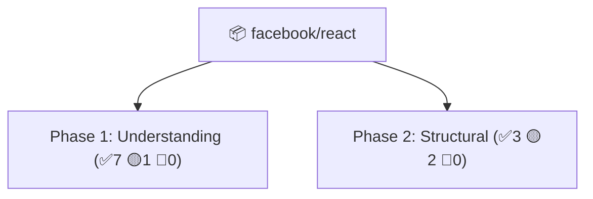

# Comprehensive Analyzer - Quick Reference

## One-Liner Commands

```bash
# Analyze and view table (default)
python comprehensive_analyzer_cli.py facebook/react

# Get JSON data (for programmatic use)
python comprehensive_analyzer_cli.py facebook/react --format json

# Get Mermaid diagram (copy to GitHub markdown)
python comprehensive_analyzer_cli.py facebook/react --format mermaid

# Get CSV (open in Excel/Sheets)
python comprehensive_analyzer_cli.py facebook/react --format csv

# Get D3 visualization data (for dashboards)
python comprehensive_analyzer_cli.py facebook/react --format d3json
```

## Output Files Generated

After running analysis, you get files like:
- `react_report.txt` - Human-readable report
- `react_analysis.json` - Structured data
- `react_diagram.md` - Mermaid syntax
- `react_findings.csv` - Spreadsheet format
- `react_visualization.json` - D3 format

## Color Legend

| Color | Status | Meaning | Action |
|-------|--------|---------|--------|
| 🟢 GREEN | ✅ | No issues, code is good | Monitor & maintain |
| 🟡 YELLOW | ⚠️ | Needs attention | Address in next sprint |
| 🔴 RED | 🔴 | Critical/blocking issues | Fix immediately |

## Analysis Structure

```
Repository Analysis
    ├─ Tech Stack Detection
    │   ├─ Languages detected
    │   ├─ Frameworks found
    │   └─ Config files
    │
    ├─ Phase 1: Understanding (Context)
    │   ├─ File inventory
    │   ├─ Dependencies
    │   ├─ Core functionality
    │   └─ Data flow
    │
    ├─ Phase 2: Structural (Architecture)
    │   ├─ Architectural patterns
    │   ├─ Coupling & cohesion
    │   └─ Design patterns
    │
    ├─ Phase 3: Quality (Maintainability)
    │   ├─ DRY principle
    │   ├─ Complexity
    │   ├─ Readability
    │   └─ Error handling
    │
    └─ Phase 4: Security (Safety)
        ├─ Input validation
        ├─ Secrets management
        ├─ Auth/permissions
        └─ Dependency scanning
```

## Finding Format

Each finding contains:

```
Phase:           Which analysis phase (1-4)
Status:          ✅ GREEN, ⚠️ YELLOW, or 🔴 RED
Title:           Brief description
Location:        File/directory path
Impact:          What could go wrong
Recommendation:  How to fix it
```

## Example Finding

```
Phase:           1: Understanding
Status:          ✅ GREEN
Title:           File inventory complete
Location:        Root
Impact:          Found 450 files in 25 directories
Recommendation:  Repository has measurable scope
```

## Bulk Analysis Pattern

Analyze multiple repos and compare:

```python
#!/usr/bin/env python3
from comprehensive_repo_analyzer import ComprehensiveRepoAnalyzer
import json

repos = [
    'facebook/react',
    'vuejs/vue',
    'angular/angular'
]

all_reports = {}

for repo in repos:
    owner, name = repo.split('/')
    analyzer = ComprehensiveRepoAnalyzer(owner, name)
    report = analyzer.generate_report()
    all_reports[repo] = report

# Save comparison
with open('repo_comparison.json', 'w') as f:
    json.dump(all_reports, f, indent=2)

# Print summary
for repo, report in all_reports.items():
    summary = report['analysis_summary']
    print(f"{repo}: {summary['total_findings']} findings "
          f"({summary['status_breakdown']['green']} green, "
          f"{summary['status_breakdown']['red']} red)")
```

## Integration with Your UI Component System

```
Your Workflow:
1. Analyze repo → detect tech stack (React/Vue/etc)
2. Run 4-phase analysis → get quality baseline
3. Get diagram output → visualize findings
4. Plan component migration → enforce standards
5. Validate component usage → in CI/CD

This tool handles steps 1-3 automatically.
```

## Diagram Output Examples

### Table Format
```
Repository: facebook/react
Total Findings: 12
  ✅ GREEN: 7
  ⚠️ YELLOW: 3
  🔴 RED: 2
```

### Mermaid Format


### CSV Format
```csv
Phase,Status,Title,Location
1: Understanding,✅ GREEN,File inventory complete,Root
2: Structural,⚠️ YELLOW,Source/test organization,Directory structure
```

## Troubleshooting Quick Tips

| Issue | Solution |
|-------|----------|
| "API rate limit exceeded" | Wait 1 hour or add GitHub token |
| "Repository not found" | Check URL format: owner/repo |
| "No findings generated" | Repo might be empty or private |
| "Slow analysis" | First run fetches files; subsequent runs are faster |

## Most Important Status Codes

When reviewing results, **focus on RED findings first:**

### 🔴 RED (Block)
- Missing README
- No test configuration
- Secrets exposed (.env in repo)
- No security scanning

### 🟡 YELLOW (Schedule)
- Missing linting config
- No .gitignore
- Large files detected
- Architecture unclear

### 🟢 GREEN (Good)
- Code has organization
- Dependencies tracked
- Tests configured
- Security scanning enabled

## Next Steps

1. **Run analysis** on your organization's repos
2. **Export results** in diagram format
3. **Review findings** by severity (RED → YELLOW → GREEN)
4. **Create action items** from recommendations
5. **Track progress** on improvements over time

---

**Quick Test:** 
```bash
python comprehensive_analyzer_cli.py torvalds/linux --format mermaid
```
(This will work - Linux kernel is public)
